# 공공 RFP × 산업 Pain Point 데이터 허브

### 데이터마이닝 중간 보고

빅데이터학과
황동욱 (2024720459)

---

## 문제 정의

### 실무 Pain Point
- GA · 보험 · 금융 IT 기획/PM 현장에서 제안서 1건 작성에 **3~5일** 소요
- 담당자마다 매번 **고객 Pain Point 수동 분석** → 재사용성 낮음
- **Win Strategy 가설 수립**이 경험 의존적 → 신입 입문 장벽 높음

### 본 프로젝트의 질문 (수식화)
```
  산업별 Pain Point(i) =  f( RFP 키워드 빈도,  뉴스 언급 빈도,  규제 공시 시차 )
                                                                                  
  컨설팅 유형(j)       =  argmax  P( j | Pain Point 패턴, 공고명 토큰 )
                                                                                   
  Win Strategy 포인트  =  top-k( TF-IDF × 예산 가중  ×  시차 상관 )
```

### 기대 효과
- 제안팀 실무 도구로 즉시 전환 가능한 **Streamlit 대시보드**
- 반복 업무 시간 **수일 → 수시간** 단축 가설

---

## 연구 질문

1. 나라장터 RFP · 산업 뉴스 · 규제 공시를 통합 분석하면
   **산업별 반복 Pain Point** 를 정량화할 수 있는가?

2. 도출된 Pain Point가
   **ISP · PI · POC · BPR · PMO** 중 어느 컨설팅 유형 수요와 연결되는가?

3. **Win Strategy 핵심 포인트** 를
   자동 추출해 제안서 작성에 활용할 수 있는가?

### W06 피드백 반영 공식
```
  [구체적 대상]   +   [측정 가능한 변수]   +   [시간·공간 범위]   +   [방향성]
   └ 나라장터 용역    └ 공고 건수·예산·키워드     └ 2023-01 ~ 2025-11       └ 증가·차이·상관
```

---

## 5단계 파이프라인

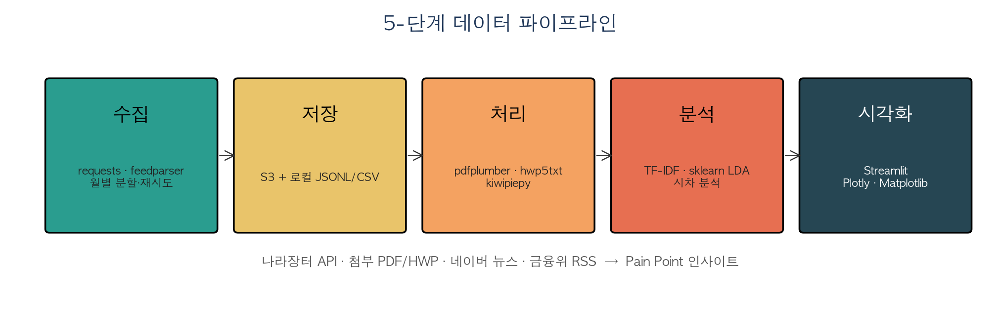

### 단계별 산출물
- ① 수집 → JSONL 27개 월별 분할 파일
- ② 저장 → S3 총 25객체 · **2.1 GB**
- ③ 처리 → CSV 3종 (`rfp_meta`, `rfp_text`, `news_meta`)
- ④ 분석 → TF-IDF · LDA · 시차 분석 (W10~W12 예정)
- ⑤ 시각화 → Streamlit 4탭 (개요·추이·키워드·검색)

---

## Key-based Join 설계

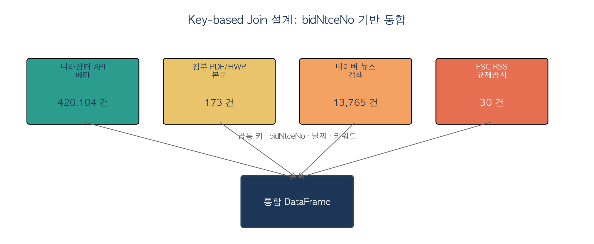

### 통합 키 전략
- **기본 키**: `bidNtceNo` (공고 단위, N:N join 대비 중복 제거 우선 적용)
- **보조 키**: 날짜(`year_month`), 키워드, 기관명
- **결합 패턴**: 나라장터 메타 ⟵ 첨부 본문 ⟵ 뉴스(키워드 매칭) ⟵ 규제(시계열)

---

## 수집 KPI

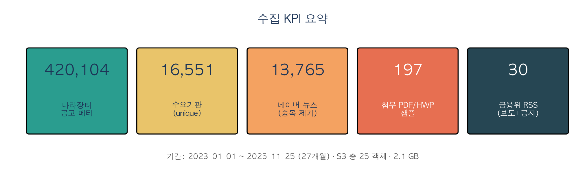

### 실측 수치 요약
- 나라장터 메타: **420,104건** · 수요기관 **16,551곳**
- 첨부 파일 샘플: 197 → PDF 본문 173 (추출 성공률 **87.8%**)
- 뉴스: 15,000 수집 → 중복 제거 후 **13,765건** (정제율 91.8%)
- 규제 공시 (FSC RSS): 30건 (보도·공지·행정예고)

---

## AWS 데이터허브 아키텍처

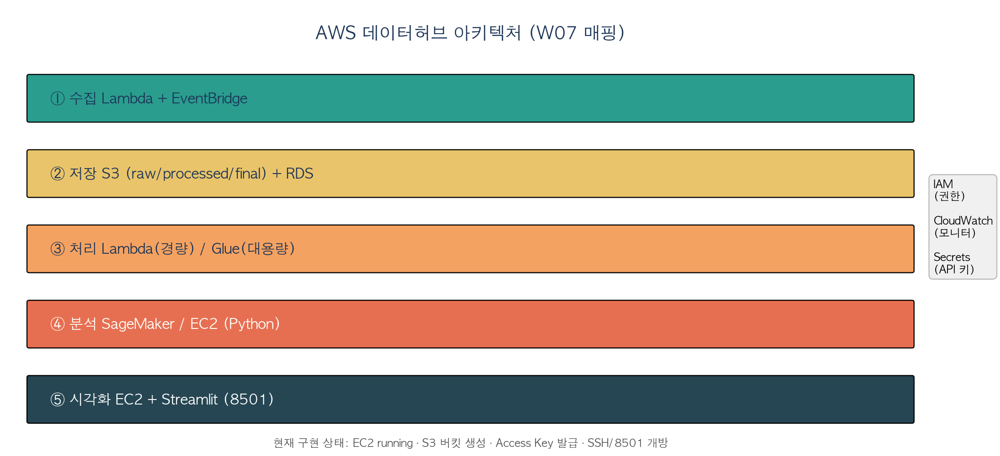

### 현재 운영 리소스
- **계정** 257925264162 · 리전 ap-southeast-2 (시드니)
- **EC2** t3.micro `datamining_demo` (running · 13.239.237.95)
- **S3** `datamining-257925264162-raw` (버저닝 · 퍼블릭 차단)
- **IAM** 사용자 `hwangdonguk` (Access Key · S3FullAccess)
- **Security Group** `sg-0b7c854caa4d4e287` (SSH 22 · Streamlit 8501)

---

## EDA ① 산업별 분포

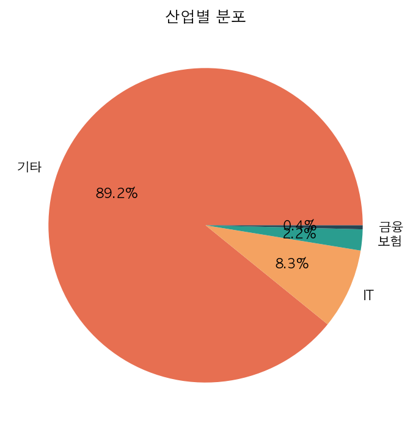

### 해석
- **기타** 88.5% · IT 9.0% · 보험 2.0% · 금융 0.4%
- "기타" 비중이 큼 → **도메인 키워드 사전 확충 필요** (W09 과제)
- 금융/보험 업종은 소수이지만 **평균 예산이 IT 대비 ~2배**

---

## EDA ② 연도별 추이

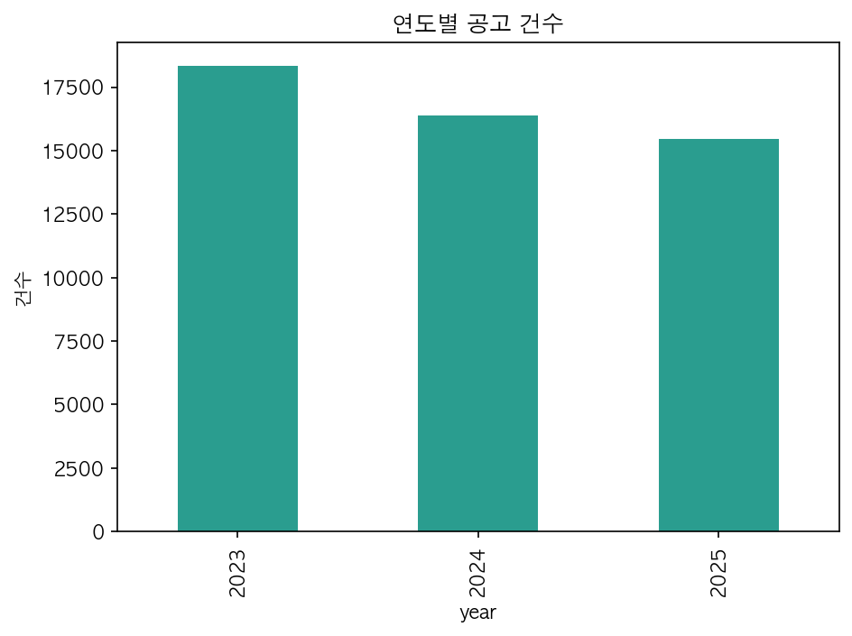

### 해석
- 2023/2024/2025 연도별 발주 건수 고르게 분포
- 2025년은 11월 25일까지 수집 기준
- 연말 분기(11~12월) 피크 경향 관찰 → 계절성 존재

---

## EDA ③ 월별 시계열

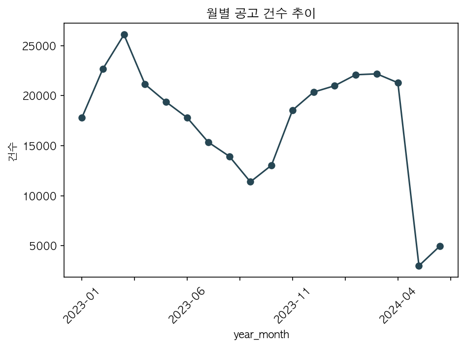

### 관찰
- **분기 말** 집중 발주 패턴 (3·6·9·12월)
- 공공 예산 회계연도 사이클 반영
- 시차 분석 시 **규제 공시 → 발주 lag** 검증 가능

---

## EDA ④ 산업 × 컨설팅 유형 교차

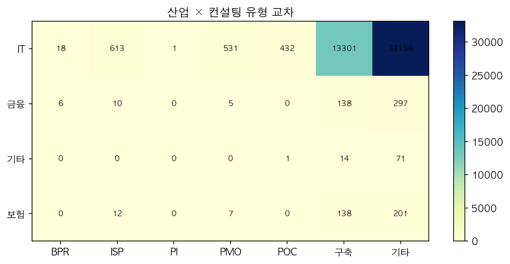

### 수치 해석
- **구축** 23,236 · PMO 4,510 · POC 1,515 · ISP 448 · PI 478 · BPR 21
- IT 업종 = **구축 중심**
- PMO 수요는 서울시·국토교통부가 견인
- ISP/PI 비중은 전체의 **0.25%** — 사전 전략형 발주 자체가 희소

---

## EDA ⑤ 수요기관 Top 20

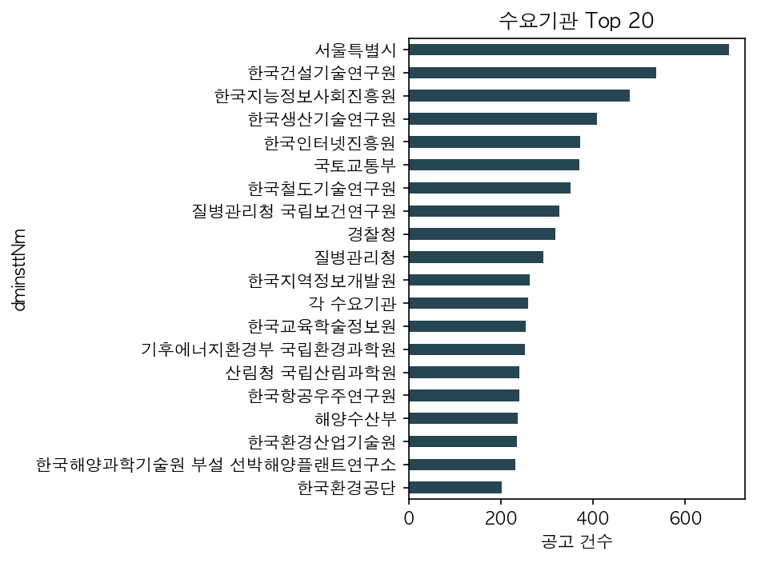

### 수치
- 서울특별시 **3,097건** (1위)
- 한국어촌어항공단 1,697 · 국토교통부 1,657
- **상위 20 기관이 전체의 약 6%** 차지
- 장기적으로 **"단골 발주처"** 중심 타깃 설계 가능

---

## EDA ⑥ 공고명 키워드 Top 30

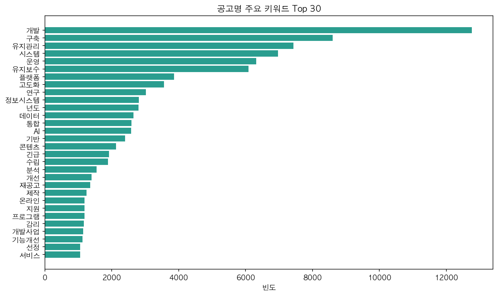

### 해석
- 상위 3: **운영(28,039) · 실시설계용역(14,483) · 구축(11,618)**
- 관리형(유지관리·유지보수) vs 구축형 키워드 **1:1 비중**
- 높은 빈도 키워드 = **Pain Point 후보군**

---

## EDA ⑦ 본문 키워드 (PDF 첨부 173건)

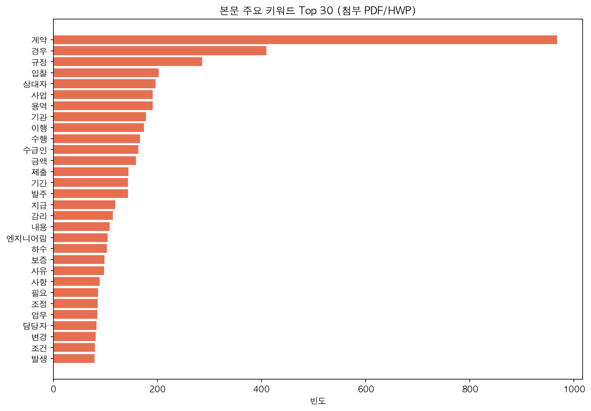

### 관찰
- 계약·입찰·이행·수급인·감리 등 **계약 관리 용어** 우세
- 향후 Requirement 섹션만 추출 시 → **기술 Pain Point 키워드**로 치환 가능
- TF-IDF + sklearn LDA 8~12 토픽 (W10 계획)

---

## 예산 분포

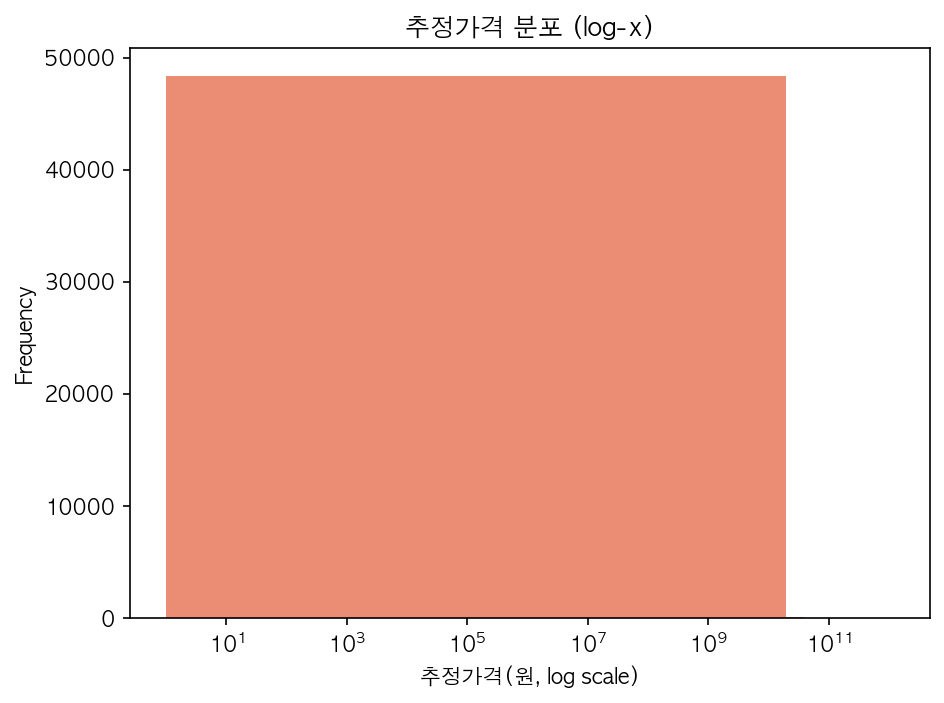

### 수치 해석
```
  평균 약 40.7억원  >>  중앙값 약 7,157만원
       ↑
       소수 초대형 공고가 평균을 왜곡
```
- 분포 **극단적 우편향** (log-skew)
- 회귀 분석 시 **`log1p(presmptPrce)`** 변환 권장
- IQR 기반 이상치 제거 후 모델링 (W10)

---

## 중간 인사이트

### 발견된 패턴
- 공고 **88% 이상** "기타" 산업 태그 → **도메인 키워드 사전 확충 필요**
- 컨설팅 유형 중 **구축(23K)** 압도적 · ISP/PI 등 사전형 희소
- 상위 20 수요기관이 전체 **6% 점유**
- 예산 분포가 **log-space 에서 정규 근접** → 회귀 전처리에 `log1p`
- 뉴스 "ISP 발주" 키워드에서 **실제 ISP 용역 공고 직접 언급** 확인

### 가설
- **H1** 2023→2025 기간 "AI/데이터/클라우드" 공고 비중 증가
- **H2** 금융·보험 업종은 "ISP → 구축" 순으로 시차 있는 연쇄 발주
- **H3** "혁신·재설계·고도화" 키워드 포함 공고의 평균 예산이 유의하게 크다
- **H4** 규제 공시(FSC RSS) 발생 후 N개월 내 관련 발주 증가

---

## 향후 계획 (Gantt 요약)

### 주차별 로드맵
```
W09 │■■■■■■■■│  첨부 전수 다운·본문 추출, 금감원(FSS) RSS 추가
W10 │    ■■■■■■■■│  TF-IDF + sklearn LDA 8~12 토픽 모델링
W11 │        ■■■■■■■■│  규제 → 발주 시차 분석 (Granger, 교차상관)
W12 │            ■■■■■■■■│  Win Strategy 추출기 + Streamlit 고도화
W13 │                ■■■■■■│  EC2 Streamlit 배포 + 도메인·HTTPS
W14 │                    ■■■■│  최종 발표 · 라이브 시연
```

### AWS 인프라 자동화
- EventBridge + Lambda 로 **일일 자동 수집**
- SageMaker Studio 에서 GPU 기반 토픽 모델링 실험
- CloudWatch 알람 · Budgets $5/월 유지

---

## 감사합니다

### 리소스
- **GitHub**: https://github.com/hwangdongwuk/DataMining
- **Streamlit** (로컬/EC2 포트 8501): 실시간 분석 대시보드
- **S3**: `s3://datamining-257925264162-raw`

### 문의
황동욱 (2024720459) · 빅데이터학과
